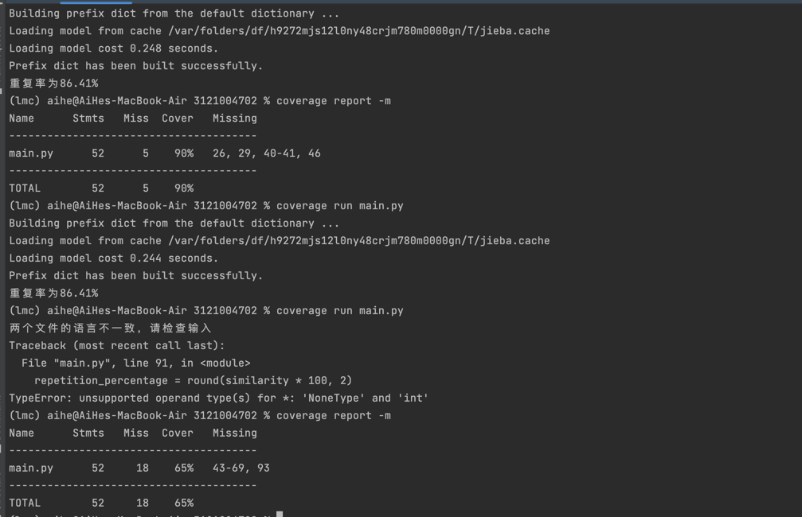

| 所属课程软件工程导论 |        [link](https://edu.cnblogs.com/campus/gdgy/CSGrade21-12)         |
|------------|:-----------------------------------------------------------------------:|
| 作业要求       | [link](https://edu.cnblogs.com/campus/gdgy/CSGrade21-12/homework/13014) |
| 作业目标       |      完成一个个人开发的项目，体会完整的软件开发流程，编写SPS，实现程序效能瓶颈分析，单元和回归测试，熟悉github代码托管      |

| PSP2.1 | Personal Software Process Stages | 预估耗时（分钟） | 实际耗时（分钟） ||
|---|---|----------|----------|---|
|Planning| 计划| 30       | 20       |
|Estimate|估计这个任务需要多少时间| 30       | 30       |
|Development|开发| 100      | 80       |
|Analysis|需求分析 (包括学习新技术)| 40       | 30       |
|Design Spec|生成设计文档| 30       | 30       |
|Design Review|设计复审| 30       | 20       |
|Coding Standard|代码规范 (为目前的开发制定合适的规范)| 20       | 20       |
|Design|具体设计| 50       | 40       |
|Coding|具体编码| 120      | 100      |
|Code Review|代码复审| 30       | 20       |
|Test|测试（自我测试，修改代码，提交修改）| 120      | 140      |
|Reporting|报告| 100      | 80       |
|Test Repor|测试报告| 100      | 60       |
|Size Measurement|计算工作量| 30       | 30       |
|Postmortem & Process Improvement Plan|事后总结, 并提出过程改进计划| 30       | 30       |
||合计|          |          |

# 设计与实现过程
项目截图

作业分为两个版本。
+ 一个是main_simple.py,使用difflib库，基于最长公共子序列（Longest Common Subsequence, LCS）的概念以及动态规划算法。
适用于较短的文本段落，如：今天是星期天，天气晴，今天晚上我要去看电影。更多的是简单的字符匹配，没有语义信息
+ 一个是main.py，使用机器学习的方法，采用分词，embedding，转化为向量，计算余弦相似度，基于NLP（natural language processing）的思想
适用于普遍意义上的论文查重，可以处理大量的文本数据，可以拿到文本的语义信息

# main
共有三个函数，一个读取文件（read_file），一个检测文本的语言（detect_language），一个完成重复率的计算（cosine_similarity）
1. 首先读取源文件和抄袭文件
2. 检测二者的语言类别（中文还是英文）
3. tokenize，然后转为张量，嵌入，计算相似度

# main_simple
1. 调用Python标准库difflib中的difflib.SequenceMatcher类，它可以用来比较任何类型的序列,其中ratio函数，可以用来计算两个序列之间的相似度
2. 详情请见[官方文档](https://docs.python.org/3/library/difflib.html)

由于是废稿，后面想起来可以NLP，后面不再赘述

## 关键算法
+ 先对两个文本进行分词，然后用词袋模型来表示每个文件的文本向量，然后我会用TF-IDF方法来加权每个词的重要性（一种考虑词频和逆文档频率的加权方法，它可以降低常见词的权重，提高稀有词的权重），最后用numpy库来计算两个向量的余弦相似度，并输出重复率。
## 独到之处
1. 没有造轮子
2. 善于利用搜索引擎，尤其是某Generative Pre-Training Transformer大模型
3. 使用了机器学习，自然语言处理方面的思想
4. 有两个作业plan

# 后续相关改进
## 性能分析图
使用pycharm的line_profiler_pycharm来分析代码性能,[教程](https://zhuanlan.zhihu.com/p/215302708)

从中可以看出耗时最多的是文件的读取和nltk.corpus.stopwords的导入

外部包的调用无法优化，文件读取尝试过多线程，提前载入缓存，分块读取文件等方法，均无明显改进，即暂无法改进性能

# Code Quality Analysis
使用pycharm内置的inspect code来完成静态代码分析，代码风格检查，是否重构，代码度量等等问题

图中为两个拼写问题，无伤大雅
# 单元测试

导入 unittest 模块，编写一个测试类,在其中定义一些以 test 开头的测试方法。每个测试方法都可以使用 self.assertXXX () 系列的断言方法来检查代码的输出是否符合预期。

主要测试这三个函数：read_file, detect_language 和 cosine_similarity

测试截图如下

## 覆盖率
使用coverage.py工具来检测代码的覆盖率[coverage教程](https://cloud.tencent.com/developer/article/1646147)

可以看到第一次测试的覆盖率为90%，Missing为26，29，40，41，46行代码，这些代码都是处理异常数据的except

在输入异常数据后，cover覆盖到来上述代码，即覆盖率达到了100%

# 异常处理说明
## 检测文本所属语言

若文本中英文stopwords的数量超过总数一半，则将该文本归于英语，反正中文
## 文本所属语言匹配问题

若两文本所属语言不一致，则结束

# 后续改进
由于是论文查重项目，在自然语言处理的范畴，可以使用深度学习的方法来搭建模型，例如基于lstm，transfomer等等的语言处理

 

 

